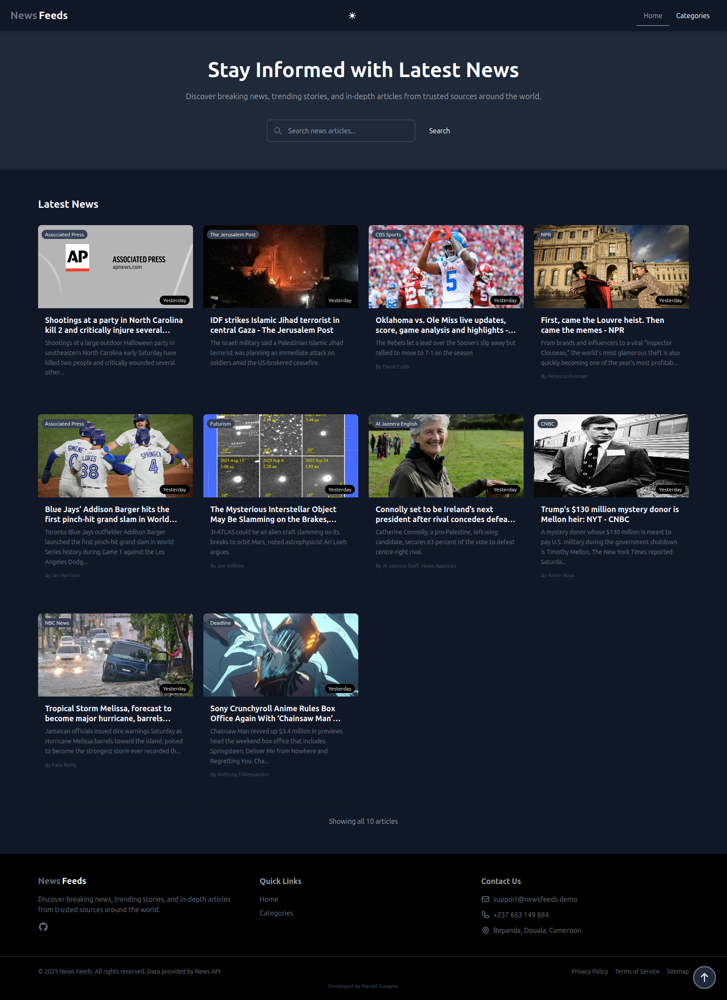
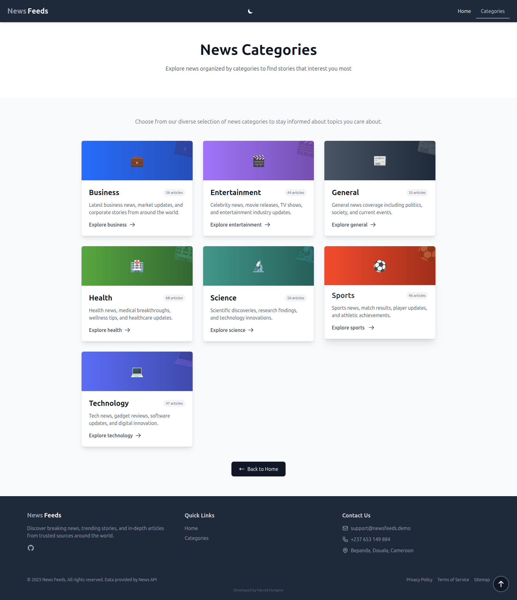

# 📰 News Feeds - Modern News Aggregator

A modern, responsive news aggregator built with React, Vite, and Tailwind CSS. Stay informed with the latest news from around the world, featuring real-time search, infinite scrolling, and a beautiful dark mode interface.


## ✨ Features

### 🎨 User Interface
- **Dark/Light Theme Toggle** - Seamless theme switching with persistent preferences
- **Responsive Design** - Optimized for mobile, tablet, and desktop devices
- **Smooth Animations** - Polished transitions and hover effects
- **Back to Top Button** - Quick navigation with scroll progress indicator

### 📰 News Features
- **Top Headlines** - Latest breaking news from trusted sources
- **Category Browsing** - Explore news by category (Business, Technology, Sports, Health, Science, Entertainment, General)
- **Advanced Search** - Real-time search with debouncing for better performance
- **Infinite Scroll** - Seamlessly load more articles as you scroll
- **Search Highlighting** - Highlights matching terms in article titles and descriptions

### 🚀 Performance
- **API Caching** - 15-minute cache to reduce API calls and improve speed
- **Retry Logic** - Automatic retry on failed requests with exponential backoff
- **Optimized Loading** - Skeleton loaders for better perceived performance
- **Lazy Loading** - Images and content load on demand

### 🎯 User Experience
- **Breadcrumb Navigation** - Easy navigation between pages
- **Article Previews** - View source, author, and publication date
- **Error Handling** - Graceful error messages and fallbacks
- **Loading States** - Clear feedback during data fetching
- **Empty States** - Helpful messages when no results are found

## 🛠️ Tech Stack

### Frontend Framework
- **React 19.1.1** - Latest React with improved performance
- **React Router DOM 7.5.0** - Client-side routing
- **Vite 7.1.7** - Lightning-fast build tool and dev server

### Styling
- **Tailwind CSS 4.1.16** - Utility-first CSS framework
- **CSS Custom Properties** - Dynamic theming support
- **Responsive Grid** - Flexible layouts for all screen sizes

### Code Quality
- **ESLint** - Code linting and best practices
- **React Hooks ESLint** - Hooks usage validation
- **Modern JavaScript** - ES6+ features

## 📁 Project Structure

```
feeds/
├── api/
│   └── news.js                   # Serverless proxy for News API (CORS fix)
├── public/
│   └── feeds.png                 # App logo
├── src/
│   ├── assets/                   # Static assets
│   ├── components/
│   │   ├── BackToTop.jsx         # Scroll-to-top button with progress
│   │   ├── FeedCard.jsx          # Article card component
│   │   ├── Footer.jsx            # Site footer
│   │   ├── Header.jsx            # Navigation header with theme toggle
│   │   ├── LoadingIndicator.jsx # Loading spinner
│   │   ├── SearchForm.jsx        # Debounced search input
│   │   └── SkeletonLoader.jsx    # Loading placeholder
│   ├── contexts/
│   │   └── ThemeContext.jsx      # Theme management (dark/light mode)
│   ├── hooks/
│   │   └── useInfiniteScroll.js  # Custom infinite scroll hook
│   ├── layouts/
│   │   └── Layout.jsx            # Main layout wrapper
│   ├── pages/
│   │   ├── Home.jsx              # Homepage with top headlines
│   │   ├── TopicArticles.jsx     # Category-specific articles
│   │   └── Topics.jsx            # Category selection page
│   ├── utils/
│   │   └── api.jsx               # API client with caching & retry logic
│   ├── App.jsx                   # Root component with routing
│   ├── main.jsx                  # Application entry point
│   └── index.css                 # Global styles & Tailwind config
├── eslint.config.js              # ESLint configuration
├── vite.config.js                # Vite configuration
├── package.json                  # Dependencies and scripts
└── README.md                     # Project documentation
```

## 🚀 Getting Started

### Prerequisites
- **Node.js** (v18 or higher)
- **npm** or **yarn**
- **News API Key** - Get your free API key from [newsapi.org](https://newsapi.org/)

### Installation

1. **Clone the repository**
   ```bash
   git clone https://github.com/Haroldrivail/feeds.git
   cd feeds
   ```

2. **Install dependencies**
   ```bash
   npm install
   ```

3. **Set up environment variables**
   
   Create a `.env` file in the root directory:
   ```env
   VITE_NEWS_API_BASE_URL=https://newsapi.org/v2
   VITE_NEWS_API_KEY=your_api_key_here
   ```

4. **Start the development server**
   ```bash
   npm run dev
   ```

5. **Open your browser**
   
   Navigate to `http://localhost:5173`

## 📝 Available Scripts

### Development
```bash
npm run dev          # Start development server with hot reload
```

### Production
```bash
npm run build        # Build for production
npm run preview      # Preview production build locally
```

### Code Quality
```bash
npm run lint         # Run ESLint to check code quality
```

## 🚀 Deployment

### Deploy to Vercel (Recommended)

1. **Push your code to GitHub**
   ```bash
   git add .
   git commit -m "Ready for deployment"
   git push origin main
   ```

2. **Import to Vercel**
   - Go to [vercel.com](https://vercel.com)
   - Click "Import Project"
   - Select your GitHub repository
   - Vercel will auto-detect Vite settings

3. **Add Environment Variable**
   - In Vercel dashboard, go to Settings → Environment Variables
   - Add `VITE_NEWS_API_KEY` with your News API key
   - Add `VITE_NEWS_API_BASE_URL` with value `https://newsapi.org/v2`

4. **Deploy**
   - Click "Deploy"
   - Your app will be live at `https://your-project.vercel.app`

### Important: CORS and API Proxy

The app uses a serverless function (`/api/news.js`) to proxy News API requests. This is required because News API's free tier doesn't allow browser requests from deployed domains (CORS restriction).

**How it works:**
- **Development** (localhost): Direct API calls work fine
- **Production** (Vercel): Requests go through `/api/news` proxy

The proxy is automatically configured in `vercel.json` and `src/utils/api.jsx`.

## 🎨 Features in Detail

### Dark/Light Theme
- Automatic system preference detection
- Manual toggle with persistent storage
- Smooth transitions between themes
- Tailwind v4 CSS-based dark mode configuration

### Infinite Scroll
- Custom React hook for scroll detection
- Automatic loading when near bottom (300px threshold)
- Throttled scroll events for performance
- Smart detection of end of results
- Works with both search and category browsing

### API Integration
- **Caching Strategy**: 15-minute cache to reduce API calls
- **Retry Logic**: Up to 3 retries with exponential backoff
- **Error Handling**: Graceful fallbacks and user-friendly messages
- **Endpoints**:
  - `/top-headlines` - Latest breaking news
  - `/everything` - Search all articles
  - Category filtering for targeted news

### Search Functionality
- **Debounced Input**: 800ms delay to reduce API calls
- **Real-time Results**: Updates as you type
- **Search Highlighting**: Matches are highlighted in results
- **Reset on Clear**: Returns to top headlines when search is cleared

## 🔧 Configuration

### Tailwind CSS v4
The project uses Tailwind CSS v4 with CSS-based configuration:

```css
@import "tailwindcss";

@variant dark (.dark &);

/* Custom utilities and animations */
```

### Environment Variables
- `VITE_NEWS_API_BASE_URL` - News API base URL
- `VITE_NEWS_API_KEY` - Your News API key

## 🌐 Browser Support

- Chrome (latest)
- Firefox (latest)
- Safari (latest)
- Edge (latest)

## 📱 Responsive Breakpoints

- Mobile: `< 768px`
- Tablet: `768px - 1024px`
- Desktop: `> 1024px`
- Large Desktop: `> 1280px`

## 🤝 Contributing

Contributions are welcome! Please feel free to submit a Pull Request.

1. Fork the project
2. Create your feature branch (`git checkout -b feature/AmazingFeature`)
3. Commit your changes (`git commit -m 'Add some AmazingFeature'`)
4. Push to the branch (`git push origin feature/AmazingFeature`)
5. Open a Pull Request

## 📄 License

This project is licensed under the MIT License.

## 👤 Author

**Harold DONGMO**
- GitHub: [@Haroldrivail](https://github.com/Haroldrivail)

## 🙏 Acknowledgments

- [News API](https://newsapi.org/) - For providing the news data
- [Tailwind CSS](https://tailwindcss.com/) - For the utility-first CSS framework
- [React](https://react.dev/) - For the powerful UI library
- [Vite](https://vitejs.dev/) - For the blazing-fast build tool

## 📸 Screenshots

### Light Mode


### Dark Mode


### Category Browsing


---

Made with ❤️ by Harold Rivail
